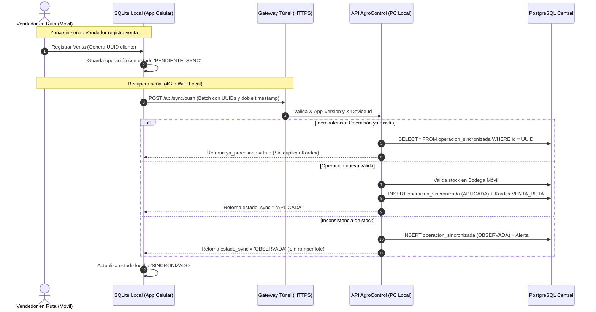

# AgroControl Pro – Guía de Red, Conectividad Híbrida y Acceso Remoto Seguro (Fase 3 / Hito 11)

---

## 1. Topología de Red y Arquitectura de Conectividad

AgroControl Pro opera bajo un modelo de **nube privada híbrida local** diseñado para una pequeña empresa comercial agrícola:
- **PC Principal del Local:** Aloja el servidor central (API NestJS, Base de Datos PostgreSQL y Frontend Web).
- **Celulares de Vendedores:** Operan en ruta bajo arquitectura **Offline-First**, registrando ventas y cobranzas en zonas agrícolas sin señal e iniciando sincronización bidireccional (`push` / `pull`) cuando detectan conexión a Internet.

```text
  ┌────────────────────────────────────────────────────────────────────────┐
  │                 RUTAS AGRÍCOLAS / ZONAS RURALES                        │
  │                                                                        │
  │    [Celular Vendedor 1]            [Celular Vendedor 2]                │
  │    (App Android Offline)           (App Android Offline)               │
  │             │                               │                          │
  └─────────────┼───────────────────────────────┼──────────────────────────┘
                │ 4G / WiFi Rural               │ 4G / WiFi Rural
                ▼                               ▼
       ══════════════════════════════════════════════════════
          TÚNEL CIFRADO PUNTO A PUNTO (HTTPS / TLS 1.3)
          Sin puertos abiertos en el router ni IP pública fija
       ══════════════════════════════════════════════════════
                                │
                                ▼
  ┌────────────────────────────────────────────────────────────────────────┐
  │                 ESTABLECIMIENTO COMERCIAL (LOCAL)                      │
  │                                                                        │
  │   PC PRINCIPAL (Servidor Central)                                      │
  │   ├── Docker Compose / Servicio Host                                   │
  │   │     ├── API NestJS (Puerto 3000) ◄─── Conectado al Túnel           │
  │   │     │     ├── Guard de Versión (X-App-Version >= 1.0.0)           │
  │   │     │     ├── Guard de Terminal Autorizado (X-Device-Id)           │
  │   │     │     └── JWT Bearer Token (Autenticación de Trabajador)       │
  │   │     │                                                              │
  │   │     └── PostgreSQL (Puerto 5432/5433 - AISLADO EN RED INTERNA)     │
  │   │           └── [REGLA INNEGOCIABLE: CERO ACCESO EXTERNO A BD]       │
  │   │                                                                    │
  │   └── Red LAN Local (WiFi Comercial para sincronización al retorno)    │
  └────────────────────────────────────────────────────────────────────────┘
```

---

## 2. Invariante Innegociable de Seguridad: Aislamiento de Base de Datos

> [!CAUTION]
> **PROHIBICIÓN ESTRICTA DE NAT / PORT FORWARDING PARA POSTGRESQL**
> 1. Ningún puerto de la base de datos (5432 ni 5433) debe ser redirigido en el router hacia Internet.
> 2. Los terminales móviles **NUNCA** se conectan directamente a la base de datos PostgreSQL; toda comunicación se realiza estrictamente a través de los endpoints de la API (`/api/sync/pull` y `/api/sync/push`).
> 3. La base de datos solo acepta conexiones en `localhost` o en la red puente interna de Docker (`agrocontrol-network`).

---

## 3. Opciones Recomendadas de Despliegue de Túnel Remoto

Para permitir que los celulares en ruta se sincronicen con la PC del local comercial sin requerir una IP pública fija ni configurar puertos en el router del proveedor de Internet (habitualmente detrás de CGNAT en Perú), se contemplan dos alternativas técnicas homologadas:

### Opción A: Cloudflare Tunnel (`cloudflared`) — Recomendada para Producción

Cloudflare Tunnel crea una conexión saliente segura desde la PC principal hacia la red global de Cloudflare. Provee un subdominio público HTTPS con certificados SSL automáticos y protección contra ataques DDoS.

#### Pasos de Instalación en la PC del Local:
1. **Descargar el ejecutable de Cloudflare Tunnel para Windows:**
   - Descargar `cloudflared-windows-amd64.msi` desde el portal oficial de Cloudflare.
2. **Iniciar sesión en Cloudflare:**
   ```powershell
   cloudflared tunnel login
   ```
3. **Crear el túnel dedicado para AgroControl:**
   ```powershell
   cloudflared tunnel create agrocontrol-local
   ```
4. **Crear el archivo de configuración `C:\Users\USUARIO\.cloudflared\config.yml`:**
   ```yaml
   tunnel: <TUNNEL_ID>
   credentials-file: C:\Users\USUARIO\.cloudflared\<TUNNEL_ID>.json

   ingress:
     # Enrutar el tráfico de la API de sincronización móvil
     - hostname: sync.agrocontrol.pe
       service: http://localhost:3000
     # Regla de captura por defecto
     - service: http_status:404
   ```
5. **Configurar el registro DNS en Cloudflare:**
   ```powershell
   cloudflared tunnel route dns agrocontrol-local sync.agrocontrol.pe
   ```
6. **Instalar y arrancar el túnel como servicio de Windows:**
   ```powershell
   cloudflared service install
   Start-Service cloudflared
   ```
   *El túnel se ejecutará automáticamente en segundo plano cada vez que se encienda la PC.*

---

### Opción B: Tailscale (Mesh VPN basado en WireGuard) — Alternativa Privada

Tailscale crea una red privada virtual cifrada punto a punto entre la PC principal y los dispositivos móviles mediante el protocolo WireGuard.

#### Pasos de Instalación:
1. **En la PC Principal (Windows):**
   - Instalar el cliente Tailscale y autenticarse con la cuenta institucional de la empresa.
   - La PC recibirá una IP fija privada dentro del rango de Tailscale (ejemplo: `100.80.20.10`).
2. **En los Celulares de los Vendedores (Android):**
   - Instalar la app oficial de Tailscale desde Google Play Store.
   - Iniciar sesión con la misma organización.
   - Activar la conexión VPN en el teléfono.
3. **Configuración de la App Móvil:**
   - URL base de la API: `http://100.80.20.10:3000/api` (o HTTPS con certificado local).
   - Solo los dispositivos registrados en la red Tailscale pueden alcanzar el servidor.

---

## 4. Protocolo de Operación Offline-First y Sincronización



---

## 5. Control de Versiones y Diagnóstico Operativo

1. **Cabecera Obligatoria de Versión:**
   - Todo request móvil debe incluir `X-App-Version: 1.0.0` (o versión actual).
   - Si un terminal intenta sincronizar con una versión obsoleta, el servidor responderá de inmediato:
     ```json
     {
       "statusCode": 426,
       "error": "Upgrade Required",
       "message": "Versión de aplicación móvil obsoleta (0.8.0). Se requiere la versión 1.0.0 o superior para sincronizar de manera segura."
     }
     ```
     *Esto previene la corrupción de estructuras de datos en caso de cambios en el esquema.*

2. **Monitoreo de Sincronizaciones con Descalces:**
   - El personal administrativo puede auditar en tiempo real cualquier discrepancia mediante:
     ```http
     GET /api/sync/operaciones-observadas
     Authorization: Bearer <TOKEN_ADMIN>
     ```
   - Las operaciones observadas permiten a la gerencia identificar si un vendedor intentó vender mercadería no cargada en su bodega móvil o a precios no autorizados, antes de proceder con el acta formal de liquidación.
